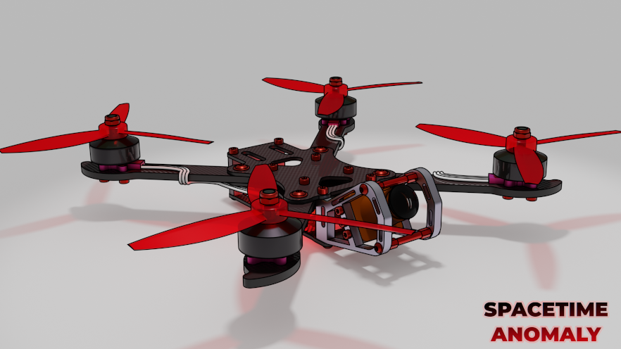

# Spacetime Anomaly

## Openhardware FPV Freestyle frame

Built with FreeCAD 0.18, renders done with Blender.

Toplevel file `anomaly.fcstd` requires [A2plus](https://www.freecadweb.org/wiki/A2plus_Workbench) FreeCAD plugin.

This is a version 1 of the frame, multiple improvements are planned for
version 2 which should be good for production.

